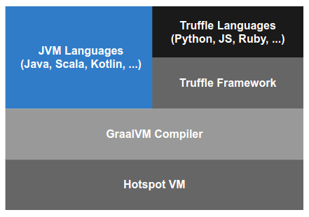
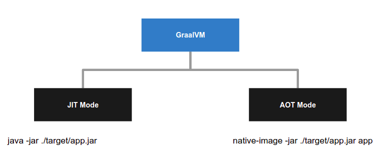
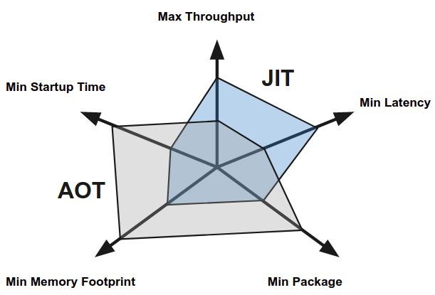
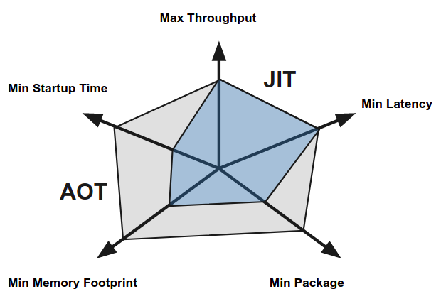
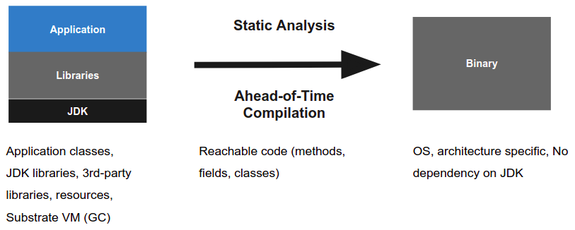
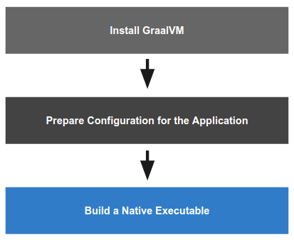

+++
title = "Building Native Scala Applications with GraalVM"
description = "Building a Native Executable or Library for a Scala Application"
[taxonomies]
tags = [ "scala", "graalvm", "native-image" ]
+++

GraalVM is a high-performance JDK distribution. It allows execution of applications written in JVM languages (Java, Scala, Kotlin, ...) and supports popular non-JVM languages: JavaScript, Ruby, Python, R.

These languages can interoperate with the help of the Truffle Framework - a framework for writing interpreters for programming languages. In this way, several programming languages can be mixed in a single application where they can directly interact in the same memory space without overhead.

## GraalVM Overview



Features

- High Performance
- Language Interoperability
- Just-in-Time (JIT) compilation
- Ahead-of-Time (AOT) compilation

## GraalVM Modes



GraalVM offers several runtime Modes:

- (1) JIT (Just-in-Time Compilation) - application is loaded and executed normally on the HotSpot VM with the GraalVM compiler. In this case bytecode goes to the compiler, being compiled into the machine code and runs after that.

- (2) AOT (Ahead-of-Time Compilation) - application code is compiled into a binary executable or a shared library. The final binary is self-contained, specific to the operating system and machine architecture it is built on, and does not require a JVM to run.

## GraalVM Mode Tradeoffs



With different modes of execution, JIT and AOT, there are some inherent trade-offs.

JIT - with the help of Just-in-Time (JIT) optimizing compilers we're eventually getting higher throughput and lower latency: at runtime, the information about the application is gathered and can be used later to create fast and optimized machine code.

AOT - the code is compiled once and, when started, we do not have means to interpret it in a different way or gather profiling feedback in order to optimize it during execution. However, an application starts faster and has a small memory footprint.

## GraalVM Goals



One of the GraalVM goals is to improve the performance of languages that run on the JVM.

To accomplish that in AOT mode, GraalVM Enterprise Edition incorporates Profile-Guided Optimization (PGO)[^1]. PGO adds the possibility to instrument binary executable, collect the profiling information and use it to optimize the performance of the resulting binary later.

## GraalVM Ahead-of-Time Compilation (AOT) Mode

- Allows to compile your JVM application into a single executable / library
- Instant startup
- Low memory footprint
- AOT eventual throughput *might be*[^2] lower comparing to JIT
  - JIT has better knowledge about how the application works, has the profiling feedback
  - run with PGO to optimize the execution if available.
- AOT latencies *might be*[^2] worse
  - By default there is a regular Serial GC (optimized for low memory footprint and small heap sizes)
  - More advanced GCs are available in GraalVM Enterprise Edition

## GraalVM Native Image Creation



To build a native executable (or a shared library), a native-image building tool should be used.

As an input, native-image takes application classes, JDK libraries, 3rd-party libraries, resources and  Substrate VM (deoptimizer, garbage collector (GC), thread scheduling).

Then it runs an aggressive static analysis, where all classes, packages, etc. that are reachable at run time must be known at build time ('closed-world' assumption). As a result it produces a binary that is OS and architecture specific, without dependency on JDK (unless a fallback option is specified).

## Building a Native Executable for a Scala Application



There are 3 steps to build a native Scala application:

1. Install GraalVM
2. Prepare configuration for the application
3. Build it

The main part here is to prepare the configuration. Without proper configuration there is a high chance of errors either on build- or run-time.

## Installing GraalVM

One way to get GraalVM is to use [sdkman.io](https://sdkman.io/) that provides a Command Line Interface (CLI) for installing, using and removing various Software Development Kits.

```bash
$ sdk list java
$ sdk install java 21.0.0.2.r11-grl
$ sdk use java 21.0.0.2.r11-grl
# Using java version 21.0.0.2.r11-grl in this shell.
$ gu install native-image
```

Here `gu` is a command-line utility to install and manage optional GraalVM components.

```text
================================================================================
Available Java Versions
================================================================================
 Vendor        | Use | Version      | Dist    | Status     | Identifier
--------------------------------------------------------------------------------
 GraalVM       |     | 21.0.0.2.r11 | grl     | installed  | 21.0.0.2.r11-grl    
               |     | 21.0.0.2.r8  | grl     |            | 21.0.0.2.r8-grl     
               |     | 20.3.1.2.r11 | grl     |            | 20.3.1.2.r11-grl    
```

## Prepare Configuration for the Application

### Use tracing agent to find all usages of dynamic features

The build operation relies on a static analysis of the reachable code. However, static analysis cannot trace all uses of Java Reflection, Java Native Interface (JNI), Dynamic Proxy objects (`java.lang.reflect.Proxy`), or class path resources (`Class.getResource`). These dynamic features should be specified in configuration files (require configuration at build time).

GraalVM provides an agent that helps to trace all dynamic features, used in the application, and create configuration files.

To use the agent, we need to run the app with `-agentlib:native-image-agent` parameter in JVM-environment. During this execution, the agent intercepts all calls that look up classes, methods, resources and on exit generates configuration files:

- jni-config.json
- reflect-config.json
- proxy-config.json
- resource-config.json

These files will be used to build a binary image.

It might be worth running an application several times to cover different use-cases and merge configuration files after that (merging can be automated).

```bash
$ export META_INF_DIR=./module/main/resources/META-INF/native-image
$ java \
-agentlib:native-image-agent=config-output-dir=”${META_INF_DIR}” \
-jar ./target/app.jar [...other options if needed]
```

```text
module
  src
    main
      resources
        META-INF/native-image
          jni-config.json
          proxy-config.json
          reflect-config.json
          resource-config.json
          serialization-config.json
```

As an alternative, instead of `META-INF/native-image` a more specific path, `META-INF/native-image/groupID/artifactID/` can be used.

### Build Fat JAR

Create a fat JAR of your project with all of its dependencies, for example with [sbt-assembly](https://github.com/sbt/sbt-assembly) plugin.

in `build.sbt`:

```sbt
lazy val app = (project in file("module"))
 .dependsOn(...)
 .settings(Settings.assemblySettings)
 .settings(
   name := "app",
   libraryDependencies ++= Dependencies.App,
   assembly / mainClass := Some("org.module.app"),
   assembly / assemblyOutputPath := new File(s"./target/${name.value}.jar"),
   assembly / assemblyJarName := s"${name.value}"
 )
```

### Edit Configuration (Optional)

The resulting configurations could be too complex OR there can be missing elements. It is recommended to review the generated configuration files (*jni-config.json, reflect-config.json, proxy-config.json, resource-config.json*)

For example, it might be worth to remove references to Lambda objects:

`ZIO$AccessPartiallyApplied$$$Lambda$32/0x00000008400c2040`

### Build a Native Executable

At the end we need to invoke `native-image` utility. We can provide additional options (OR, as an alternative, it is possible to create a properties-file inside `META-INF/native-image` directory).

An example of the build command:

```bash
$ native-image \
 --verbose \
 --initialize-at-build-time="${BUILD_INIT_LIST}" \
 --initialize-at-run-time="${RUNTIME_INIT_LIST}" \
 --no-fallback \
 --allow-incomplete-classpath \
 --enable-http \
 --enable-https \
 -H:+ReportUnsupportedElementsAtRuntime \
 -H:+ReportExceptionStackTraces \
 -jar "${APP_JAR_PATH}" "${APP_NAME}"
```

Please consult the [documentation](https://www.graalvm.org/reference-manual/native-image/Options/) for the list of available options and their description.

Output:

```text
. . .

[app:3942]    classlist:   6,662.52 ms,  0.96 GB
[app:3942]        (cap):   1,000.09 ms,  0.96 GB
[app:3942]        setup:   3,337.82 ms,  0.96 GB
[app:3942]     (clinit):   1,836.09 ms,  3.27 GB
[app:3942]   (typeflow):  64,895.79 ms,  3.27 GB
[app:3942]    (objects):  55,283.05 ms,  3.27 GB
[app:3942]   (features):   3,300.29 ms,  3.27 GB
[app:3942]     analysis: 128,536.69 ms,  3.27 GB
[app:3942]     universe:   5,633.38 ms,  3.27 GB
[app:3942]      (parse):  36,065.82 ms,  4.31 GB
[app:3942]     (inline):  36,724.26 ms,  6.05 GB
[app:3942]    (compile):  97,866.60 ms,  6.47 GB
[app:3942]      compile: 174,217.81 ms,  6.47 GB
[app:3942]        image:   5,525.45 ms,  6.47 GB
[app:3942]        write:   1,353.10 ms,  6.47 GB
[app:3942]      [total]: 325,781.52 ms,  6.47 GB

. . .
```

After execution (might take time) the binary executable will be created. In case of warnings/errors it might be needed to update the configuration-files  and rebuild the application after that.

## Example

As an example, a [project](https://github.com/gchudnov/kprojekt) that was built with GraalVM using the guidelines, provided in this article.

## Summary

- native-image feature in GraalVM is [production ready](https://www.graalvm.org/docs/introduction/#features-support).
- Use native-image if you care about startup time and memory footprint
  - Unfortunately, PGO and more advanced GCs are available only in Enterprise Edition
- native-image support in 3rd-party libraries is getting better
  - `META-INF/native-image` configuration in libraries: netty, aws-sdk-2, ...

[^1]: At the moment of writing, PGO is not available in GraalVM Community Edition, CE

[^2]: **Always measure**, the performance is heavily dependent on a use-case.
